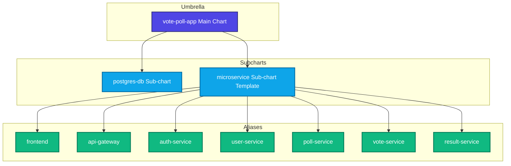
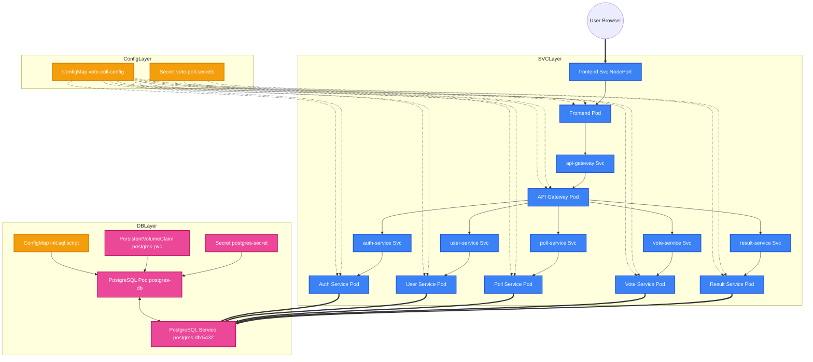

# Vote Polling Platform — Multi-Microservice Architecture on GKE

Private, highly available vote polling system with **no public IPs** on GKE, Cloud SQL, or the frontend.

## Architecture Overview

```mermaid
flowchart TB
    subgraph corp["Corporate Network / VPN / Cloud IAP"]
        Admin[Admin Browser]
        Voter[Anonymous Voter Browser]
    end

    subgraph vpc["Private VPC (no public endpoints)"]
        ILB[Internal HTTP(S) Load Balancer]

        subgraph gke["Private GKE Cluster"]
            FE[frontend-service<br/>Node.js]
            GW[api-gateway<br/>Node.js]
            AUTH[auth-service<br/>Spring Boot]
            USER[user-service<br/>Node.js]
            POLL[poll-service<br/>Spring Boot]
            VOTE[vote-service<br/>Node.js]
            RES[result-service<br/>Python FastAPI]
        end

        SQL[(Cloud SQL PostgreSQL<br/>Private IP only)]
    end

    Admin --> ILB
    Voter --> ILB
    ILB --> FE
    FE --> GW
    GW --> AUTH
    GW --> USER
    GW --> POLL
    GW --> VOTE
    GW --> RES
    AUTH --> SQL
    USER --> SQL
    POLL --> SQL
    VOTE --> SQL
    RES --> SQL
```

## Microservices

| Service | Stack | Responsibility |
|---------|-------|----------------|
| `frontend-service` | Node.js | Admin dashboard + anonymous poll pages (SPA) |
| `api-gateway` | Node.js | Routing, rate limiting, JWT validation passthrough |
| `auth-service` | Spring Boot | Admin login, JWT issue/validate |
| `user-service` | Node.js | Admin user CRUD |
| `poll-service` | Spring Boot | Poll CRUD, options, validity window, publish |
| `vote-service` | Node.js | Anonymous vote submission, duplicate prevention |
| `result-service` | Python | Aggregate votes, compute percentages, publish |

## Roles

### Admin
- Login via `/admin/login`
- Create polls with options and validity (`start_at`, `end_at`)
- View live results during poll
- Publish final results when poll ends

### Anonymous User
- Access unique poll URL: `/poll/{pollSlug}`
- Vote once per poll during validity window
- After poll ends, same URL shows published results

## Security & HA Design

1. **Private GKE** — `enable-private-nodes`, private control plane endpoint, no public node IPs
2. **Private Cloud SQL** — Private Service Connect / VPC peering, no public IP
3. **Internal Load Balancer only** — Frontend reachable only from VPC/VPN/IAP
4. **Cloud NAT** — Outbound internet for image pulls only (Artifact Registry)
5. **Pod Disruption Budgets** — Minimum availability during node upgrades
6. **HPA** — Auto-scale gateway, vote, and poll services under load
7. **Multi-replica Deployments** — Minimum 2 replicas per stateless service
8. **Cloud SQL HA** — Regional HA instance with automatic failover
9. **Health checks** — Liveness/readiness on every service

## Database (Cloud SQL PostgreSQL)

Single instance, schema-per-service:

- `auth` — admin credentials, refresh tokens
- `users` — admin profiles
- `polls` — polls, options, status
- `votes` — vote records with voter fingerprint hash
- `results` — aggregated snapshots, publish state

See `database/init.sql`.

## Local Development (Docker Compose)

Run the full stack on your machine without GCP or GKE. Requires **Docker Desktop** (or Docker Engine + Compose v2).

```bash
cd ms
chmod +x scripts/local-dev.sh

# Start all services (first run builds images — Spring Boot takes ~2–3 min)
./scripts/local-dev.sh up

# Or manually:
docker compose up --build
```

**Access**

| URL | Purpose |
|-----|---------|
| http://localhost:8080 | Frontend (admin + voter pages) |
| http://localhost:8080/admin/login | Admin login |
| http://localhost:8080/poll/{slug} | Anonymous voting page |
| localhost:5432 | PostgreSQL (user: `votepoll`, password: `changeme`) |

**Default admin credentials:** `admin@votepoll.local` / `password`

**Useful commands**

```bash
./scripts/local-dev.sh logs          # all service logs
./scripts/local-dev.sh logs poll-service
./scripts/local-dev.sh ps            # container status
./scripts/local-dev.sh down          # stop stack
./scripts/local-dev.sh reset         # stop + wipe DB volume
```

**Local smoke test**

1. Open http://localhost:8080/admin/login and sign in.
2. Create a poll with slug `team-lunch`, set start/end times around now.
3. Open http://localhost:8080/poll/team-lunch and submit a vote.
4. After end time (or click **Publish** on dashboard), view results on the same poll URL.

## Local Development (Minikube)

Run the full stack inside a local Kubernetes (Minikube) cluster simulating the GKE environment. A self-hosted PostgreSQL database runs inside a container within the cluster.

### 🎯 Phase 1: Initial Setup (One-Time)

1. **Install Prerequisites:**
   - **Docker Desktop:** [Install Guide](https://docs.docker.com/get-docker/)
   - **Minikube:** [Install Guide](https://minikube.sigs.k8s.io/docs/start/)
   - **kubectl:** [Install Guide](https://kubernetes.io/docs/tasks/tools/install-kubectl/)

2. **Start and Configure Minikube:**
   Start Minikube with sufficient resources and enable necessary addons:
   ```bash
   # Start the Minikube cluster
   minikube start --cpus=4 --memory=4096

   # Enable storage provisioner for Persistent Volumes
   minikube addons enable storage-provisioner

   # (Optional) Enable Ingress and Metrics Server
   minikube addons enable ingress
   minikube addons enable metrics-server

   # Minikube status
   minikube status

   # Delete minikube cluster
   minikube delete

   # Minikube dashboard
   minikube dashboard

   # Access Jenkins UI
   kubectl port-forward -n jenkins service/my-jenkins-jenkins-jcasc 3000:8080
   
   ```

### 🚀 Phase 2: Deploy the Application

The recommended way to deploy is using the all-in-one script. It handles building, loading, and deploying everything for you.

```bash
# From the project root
chmod +x ms/scripts/rebuild-all-minikube.sh
./ms/scripts/rebuild-all-minikube.sh
```

> **💡 Note:** You can pass `false` as an argument if you only want to build and load the images to Minikube without deploying/updating the manifests (e.g., if you plan to deploy them via Helm/ArgoCD later):
> ```bash
> ./ms/scripts/rebuild-all-minikube.sh false
> ```

**What this script does:**
1. Validates your environment.
2. Cleans old Docker images.
3. Builds fresh images for all services.
4. Loads these images into your Minikube cluster.
5. Deploys all Kubernetes manifests from `ms/k8s-minikube/`, triggering a rolling update of all services.

#### Alternative: Manual Build and Deployment
If you prefer to perform these steps manually:
```bash
# Build services
cd ms/services/auth-service && docker build -t auth-service:latest .
cd ../user-service && docker build -t user-service:latest .
cd ../poll-service && docker build -t poll-service:latest .
cd ../vote-service && docker build -t vote-service:latest .
cd ../result-service && docker build -t result-service:latest .
cd ../api-gateway && docker build -t api-gateway:latest .
cd ../frontend && docker build -t frontend-service:latest .

# Load images into Minikube
minikube image load auth-service:latest
minikube image load user-service:latest
minikube image load poll-service:latest
minikube image load vote-service:latest
minikube image load result-service:latest
minikube image load api-gateway:latest
minikube image load frontend-service:latest

# Deploy manifests (from ms directory)
cd ../..
kubectl apply -f ms/k8s-minikube/
```

#### Alternative: Deploy using Helm Chart manually
You can deploy the complete stack using the `vote-poll-app` Helm umbrella chart (located in the sibling directory `k8s-helm-charts`):

```bash
# Build and load the images to Minikube (skip deployment)
cd k8s-app && ./ms/scripts/rebuild-all-minikube.sh false

# Set the image tag to deploy (e.g. "20260731-174338" or dynamically via the generated file)
IMAGE_TAG=$(cat .image-tag)

# Navigate to the Helm chart folder
cd ../k8s-helm-charts/vote-poll-app

# Update the chart dependencies (loads local microservice and postgres-db subcharts)
helm dependency update

# Deploy the stack to Minikube
helm upgrade --install vote-poll . --namespace vote-poll --create-namespace \
  --set frontend.image.tag=${IMAGE_TAG} \
  --set api-gateway.image.tag=${IMAGE_TAG} \
  --set auth-service.image.tag=${IMAGE_TAG} \
  --set user-service.image.tag=${IMAGE_TAG} \
  --set poll-service.image.tag=${IMAGE_TAG} \
  --set vote-service.image.tag=${IMAGE_TAG} \
  --set result-service.image.tag=${IMAGE_TAG}
```

##### Helm Deployment Architecture & Flow

For a better understanding of how the Helm deployment is structured under the hood, here are the component architecture diagrams:

**1. Chart Dependency Hierarchy**
The umbrella chart `vote-poll-app` references the local template sub-charts to deploy all service instances and dependencies:



**2. Component Deployment & Relationship Flow**
Orchestration of configuration resources, databases, volume claims, microservice workloads, and internal network routing inside the namespace:



### 🔎 Phase 3: Access and Verify

Once deployed, wait for the PostgreSQL database pod to be fully ready:
```bash
kubectl wait --for=condition=ready pod -l app=postgres-db -n vote-poll --timeout=300s
```

Use `port-forward` to access services from your local machine (run each command in a separate terminal):

| Service | Port Forward Command | Local URL / Access |
|---------|----------------------|--------------------|
| **Frontend** | `kubectl port-forward -n vote-poll svc/frontend 3000:8080` | [http://localhost:3000](http://localhost:3000) |
| **API Gateway** | `kubectl port-forward -n vote-poll svc/api-gateway 8080:8080` | [http://localhost:8080/api/health](http://localhost:8080/api/health) |
| **PostgreSQL** | `kubectl port-forward -n vote-poll svc/postgres-db 5432:5432` | `localhost:5432` (User: `postgres` / Pass: `postgres_password`) |

### 🗄️ Database Configurations

| Database | Service | Purpose | JDBC Connection URL |
|----------|---------|---------|---------------------|
| `auth_db` | Auth Service | User authentication and JWT tokens | `jdbc:postgresql://postgres-db:5432/auth_db` |
| `user_db` | User Service | User profiles and personal data | `jdbc:postgresql://postgres-db:5432/user_db` |
| `poll_db` | Poll Service | Poll creation and management | `jdbc:postgresql://postgres-db:5432/poll_db` |
| `vote_db` | Vote Service | Vote records and validation | `jdbc:postgresql://postgres-db:5432/vote_db` |
| `result_db` | Result Service | Vote aggregation and results | `jdbc:postgresql://postgres-db:5432/result_db` |

### 🔄 Daily Development Workflow

1. **Make Code Changes:** Edit the source code of one or more microservices.
2. **Re-run the Deploy Script:**
   ```bash
   ./ms/scripts/rebuild-all-minikube.sh
   ```
   > **⚡ Pro Tip (Faster Iteration):** If you are only working on a single service, rebuild and redeploy just that service:
   > ```bash
   > ./ms/scripts/rebuild-single-minikube.sh <service-name>
   > # Example: ./ms/scripts/rebuild-single-minikube.sh poll-service
   > ```

### 🐛 Troubleshooting

- **Checking logs for a service:**
  ```bash
  kubectl logs -n vote-poll -l app=poll-service -f
  ```
- **Checking all service logs:**
  ```bash
  kubectl logs -n vote-poll -f --all-containers=true
  ```
- **Checking pod statuses:**
  ```bash
  kubectl get pods -n vote-poll
  kubectl describe pod <pod-name> -n vote-poll
  ```
- **Entering a container shell:**
  ```bash
  kubectl exec -it <pod-name> -n vote-poll -- /bin/sh
  ```
- **Database Connection issues:** Verify DNS resolution:
  ```bash
  kubectl exec -it <pod-name> -n vote-poll -- nslookup postgres-db
  ```

### 🧹 Cleanup

- **Stop Application (keeps database data):**
  ```bash
  kubectl delete namespace vote-poll
  ```
- **Stop Minikube:**
  ```bash
  minikube stop
  ```
- **Full Reset (Deletes cluster & all data):**
  ```bash
  minikube delete
  ```

## 📊 Monitoring Stack (Prometheus Operator)

A complete monitoring stack is defined under `k8s-helm-charts/prometheus-monitoring`. It deploys:
- **Prometheus Operator**: Manages Prometheus server and custom monitoring resources.
- **Prometheus Server**: Running with persistent volume storage (PVC).
- **Kube State Metrics**: Monitors Kubernetes resource states (Deployments, Pods, etc.).
- **Node Exporter**: Collects host level metrics (CPU, Memory, Disk, Network).
- **cAdvisor Exporter**: Scrapes container level resource usage (CPU/memory per container).
- **ServiceMonitor & PodMonitor**: Configured to scrape workloads across all namespaces.

For separation of concerns, the monitoring stack is deployed in its own namespace `monitoring`.

### 🚀 Deploying the Monitoring Stack

#### 1. Build Chart Dependencies
From your workspace directory, run:
```bash
helm dependency build k8s-helm-charts/prometheus-monitoring
```

#### 2. Deploy to Minikube
Deploy using the default values, which utilize the `standard` StorageClass for PVC:
```bash
helm upgrade --install prometheus k8s-helm-charts/prometheus-monitoring \
  --namespace monitoring \
  --create-namespace
```

#### 3. Deploy to GKE
For GKE, configure the appropriate StorageClass (such as `standard-rwo` or `premium-rwo`) and request a custom storage size:
```bash
helm upgrade --install prometheus k8s-helm-charts/prometheus-monitoring \
  --namespace monitoring \
  --create-namespace \
  --set kube-prometheus-stack.prometheus.prometheusSpec.storageSpec.volumeClaimTemplate.spec.storageClassName=standard-rwo \
  --set kube-prometheus-stack.prometheus.prometheusSpec.storageSpec.volumeClaimTemplate.spec.resources.requests.storage=20Gi
```

### 🔌 Enable Monitoring on vote-poll Microservices

#### 🛠️ Helm-Level Monitoring Integration (New Changes)
We have integrated Prometheus `ServiceMonitor` resources directly into the generic `microservice` Helm template. This removes the need to manually add `prometheus.io/scrape` labels or annotate Kubernetes Services.

1. **How it is configured**:
   * A `servicemonitor.yaml` template is defined in `k8s-helm-charts/microservice/templates/`.
   * Toggles are exposed inside the parent `vote-poll-app` configuration.
2. **How to enable it**:
   Simply toggle the `serviceMonitor.enabled` field under the respective microservice block in your `vote-poll-app/values.yaml`:
   ```yaml
   auth-service:
     serviceMonitor:
       enabled: true
       path: /actuator/prometheus
   ```

---

#### 📦 Prometheus Operator CRDs Reference

The Prometheus Operator uses **Custom Resource Definitions (CRDs)** to manage the monitoring stack yml/manifests declaratively:

| CRD | Description | Purpose |
| :--- | :--- | :--- |
| **`prometheuses`** | Prometheus Server Deployment | Provisions and manages local Prometheus server pods and storage. |
| **`prometheusagents`** | Lightweight Agent | Runs Prometheus in agent mode to scrape and forward metrics via `remote_write` (no local rules). |
| **`servicemonitors`** | Service Scrape Rules | Defines label selectors to discover and scrape Kubernetes **Services** (e.g., target microservices). |
| **`podmonitors`** | Pod Scrape Rules | Defines label selectors to discover and scrape Kubernetes **Pods** directly (bypassing Services). |
| **`prometheusrules`** | Alerting/Recording Rules | Defines rule conditions (e.g. CPU > 90%) and recording queries. |
| **`scrapeconfigs`** | Custom Scraper | Escape hatch for raw Prometheus scrape jobs (e.g., external non-k8s targets). |
| **`probes`** | Blackbox Probing | Checks external or internal HTTP/TCP uptime via Prometheus Blackbox Exporter. |
| **`alertmanagers`** | Alertmanager Deployment | Manages deployment of Alertmanager instances. |
| **`alertmanagerconfigs`** | Alert Routing | Configures routes, receivers, and inhibition rules (e.g., Slack alerts) at namespace level. |
| **`thanosrulers`** | Thanos Rules Engine | Evaluates alert rules globally against historical multi-cluster metrics. |

---

#### 🔍 Key Metrics to Verify Scrapes & App Health (PromQL)

Use the following queries inside the Prometheus UI (`http://localhost:9090`) to verify your workloads:

##### Target & Scrape Health
*   **Check Scraping Status (Per Pod)**:
    ```promql
    up{namespace="vote-poll"}
    ```
    *Returns `1` if the metrics endpoint is successfully scraped, `0` if unreachable.*
*   **Total Targets Scraped**:
    ```promql
    sum(up)
    ```

##### Pod & Container Metrics (cAdvisor)
> [!NOTE]
> On Minikube (using Docker/containerd drivers), container-level cgroup metrics are aggregated under the **Pod level** (meaning the `container` label is reported as `container=""`). Avoid using `container!=""` filters.
*   **Active Memory Usage (per Pod)**:
    ```promql
    sum(container_memory_working_set_bytes{namespace="vote-poll"}) by (pod)
    ```
*   **CPU Core Usage Rate (per Pod)**:
    ```promql
    sum(rate(container_cpu_usage_seconds_total{namespace="vote-poll"}[5m])) by (pod)
    ```
*   **Network Inbound Traffic (per Pod)**:
    ```promql
    sum(rate(container_network_receive_bytes_total{namespace="vote-poll"}[5m])) by (pod)
    ```

##### Kubernetes API State (Kube-State-Metrics)
*   **Pod Container Restarts**:
    ```promql
    sum(kube_pod_container_status_restarts_total{namespace="vote-poll"}) by (pod)
    ```
*   **Pod Status Phase breakdown**:
    ```promql
    sum(kube_pod_status_phase{namespace="vote-poll"}) by (phase)
    ```


### 🔍 Access the Prometheus Dashboard

Wait for the Prometheus pod to be ready:
```bash
kubectl get pods -n monitoring
```

Set up a port-forwarding connection to access the Prometheus UI:
```bash
kubectl port-forward -n monitoring svc/prometheus-operated 9090:9090
```
Open http://localhost:9090 in your browser to view scraped targets, execute PromQL queries, and inspect metrics.

---


## Quick Start (GKE / Production)

```bash
# 1. Provision GCP infrastructure (run in Cloud Shell)
chmod +x ms/infra/gcloud-setup.sh
./ms/infra/gcloud-setup.sh

# 2. Build and push images (after Artifact Registry is created)
export PROJECT_ID=your-project REGION=us-central1
./ms/scripts/build-and-push.sh

# 3. Deploy to GKE
kubectl apply -f ms/k8s/

# 4. Access via internal LB IP (from VPN/bastion)
kubectl get svc -n vote-poll frontend-service -o jsonpath='{.status.loadBalancer.ingress[0].ip}'
```

## API Routes (via Gateway)

| Method | Path | Auth | Description |
|--------|------|------|-------------|
| POST | `/api/auth/login` | — | Admin login |
| GET | `/api/users/me` | JWT | Current admin profile |
| POST | `/api/polls` | JWT | Create poll |
| GET | `/api/polls` | JWT | List admin polls |
| GET | `/api/polls/{slug}` | — | Public poll info |
| POST | `/api/polls/{slug}/vote` | — | Submit vote |
| GET | `/api/polls/{slug}/results` | — | Get results (if published or ended) |
| POST | `/api/polls/{id}/publish` | JWT | Publish results |

## Folder Layout

```
ms/
├── README.md
├── CONFIG-COMPARISON.md    # Minikube vs Production Cloud comparison
├── docker-compose.yml      # Local dev stack (Docker Compose)
├── .env.example
├── database/init.sql
├── infra/gcloud-setup.sh   # GCP setup script
├── scripts/
│   ├── build-and-push.sh
│   ├── deploy.sh
│   ├── local-dev.sh
│   ├── rebuild-all-minikube.sh     # Script to build and deploy all services to Minikube
│   └── rebuild-single-minikube.sh  # Script to rebuild a single service for Minikube
├── k8s/                    # Production Kubernetes manifests (GKE)
├── k8s-minikube/           # Local Kubernetes manifests (Minikube)
└── services/               # Microservice source code
```
## Troubleshooting 

1. Check direct authentication from Auth Service

```
docker exec vote-poll-auth-service-1 wget -S -O - --post-data='{"email":"admin@votepoll.local", "password":"Sushant@12"}' --header='Content-Type: application/json' http://localhost:8080/api/auth/login

## Command to down running docker with volumes and starts again
docker-compose down -v   
./scripts/local-dev.sh up

```
2. Check authentication from api-gateway endpoint
- Verify the logs for url mapping (api/auth/login on api-getway should map api/auth/login on auth service)

```
curl -X POST http://localhost:8081/api/auth/login -H "Content-Type: application/json" -d '{"email":"admin@votepoll.local", "password":"Sushant@12"}' -v

docker image rm vote-poll-frontend:latest
docker image rm vote-poll-api-gateway:latest
docker image ls
```

3. Is the API Gateway actually listening on 8081 inside Docker?
If your API Gateway container is configured like this:

```
api-gateway:
  ports:
    - "8081:8080"
```

then:

Outside Docker (your Mac): use http://localhost:8081
Inside Docker (another container): use http://api-gateway:8080
Containers communicate over the container's internal port, not the host-mapped port.

```
docker exec -it vote-poll-frontend-1 sh

## If that succeeds, your internal networking is correct.
wget -S -O - http://api-gateway:8080/health

## This should usually fail unless the gateway is actually listening on 8081 inside the container.
wget -S -O - http://api-gateway:8081/health

```